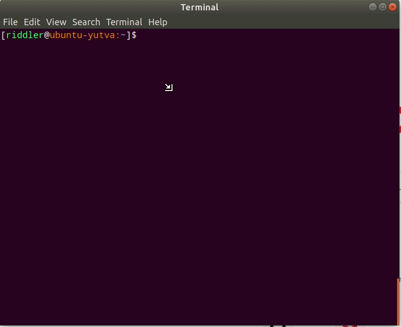

## Installation

1.  Checkout oh-my-git and switch to the "theme" branch

        sudo su -
        cd /opt
        git clone https://github.com/yutv/oh-my-git
        cd oh-my-git
        git checkout theme
        exit

2. Add the following lines into your **~/.bashrc**

        declare -A OMG_THEME=(["right_side_bg"]='green')
        source /opt/oh-my-git/prompt.sh    
     
3. Install FontAwesome

        cd /tmp
        git clone http://github.com/gabrielelana/awesome-terminal-fonts
        cd awesome-terminal-fonts
        git checkout patching-strategy
        mkdir -p ~/.fonts
        cp patched/*.ttf ~/.fonts
        
        # update the font-info cache
        sudo fc-cache -fv ~/.fonts
        
        rm -Rf /tmp/awesome-terminal-fonts
        
4. Change the Monospace font in Gnome Tweaks 

        Gnome Tweaks > Fonts > Monospace = Driod Sans Mono Awesome Regular 11

5. Now try to change directory to a git repo and you will see a git info bar, e.g.: 

